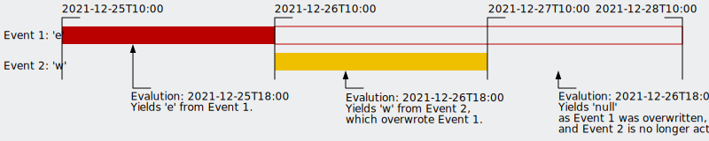

# sg.statuslog Getting Started
This page provides some information on the basic concepts of the statuslog service, as well as the most common operations.


## Basic Concept
You can understand this service as:
* a list of status events, and
* meta data information for status data extrapolation and control.

Valid status values are:
* `e` Error -- (Red) Error status; Something is not working.
* `w` Warning -- (Yellow) Warning status; Operations might be impacted.
* `g` Good -- (Green) All is good.
* `n` Neutral -- Status was not evaluated, is unknown, or has no meaning.
* `d` Dark -- (Black) Entity is (expectedly) unavailable, or status is explicitly hidden.

Each status event references an entity.
The entity can be a server, a service, a process, a data set, etc., anything you want to identify, and to collect all status values on.

For each entity, there is only one active status event.
This is the one event, with the `timestamp` in the past, and closest to the current time, and with a `validFor` time span, which ends (`timestamp + validFor days`) in the future after the current time.

This means, events can overwrite older events, even if their timestamp and validFor is shorter.

### Example
Setup:
* Event 1 is posted at `2021-12-25T10:00` with value `e`, and is valid for `3` days.
* Event 2 is posted at `2021-12-26T10:00` with value `w`, and is valid for `1` day.


_Image: Example evaluation of overlapping events_

Evaluation:
* Evaluating at `2021-12-25T18:00` will yield `e`
	* as Event 1 is active,
	* and Event 2 is not active, as it is still in the future (not recommended for production systems).
* Evaluating at `2021-12-26T18:00` will yield `w`
	* as Event 2 is now active and overwriting Event 1.
* Evaluating at `2021-12-27T18:00` will yield `null`(!)
	* Assuming that no value extrapolation has been set up for this entity.
	* Event 2 is no longer active as it reached it's end time (`timestamp + validFor days`), and
	* Event 1 is no longer active as it had been overwritten by Event 2.


## Future Value Extrapolation

TODO


## Posting Status Event
One of the most important routes is to post a new status event.
Whenever the status of an entity is evaluated, it should post it's status, even if the status value did not change since the last report.

For this, use the route: [POST `/status/event`](./api.md#post-statusevent)

Let's assume, we have a service working performing a job.
At the end of it's computation it wants to report a successful completion:
```python
import requests
request.post('https://host/status/event/',
	headers = { 'x-api-key': 'APIKEY' }),
	json = {
		'entity': 'demoworker',
		'value': 'g',
		'validFor': 1.0 / 24.0,
		'text': 'Demo operation completed successfully'
	}
)
```
This will make this positive (good) status visible for one hour.
Note, in this example, we provide an `x-api-key` http header auf authentication purpose.

Similarly, a processing failure can be reported by the same worker:
```python
import requests

errorMessage = 'Unexpected failure on something'

request.post('https://host/status/event/',
	headers = { 'x-api-key': 'APIKEY' }),
	json = {
		'entity': 'demoworker',
		'value': 'e',
		'validFor': 3.0,
		'text': f'Demo operation failed: {errorMessage}'
	}
)
```
This error will be visible, unless overruled by a next status event, for three days (making sure someone reads this after a weekend).

Similarly, simple one-liners can be made available in other programming languages, or utilizing command line programs, like _curl_.


## Querying Evaluated Entity Status
The second core functionality of the service is to provide a summary of the evaluated status of all known entities.
This is provided by the route: [GET `/status/`](./api.md#get-status)

TODO


## License
This project is freely available under the [MIT License](../LICENSE).
