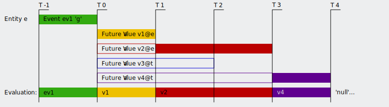

# sg.statuslog Getting Started
This page provides some information on the basic concepts of the statuslog service, as well as the most common operations.


## Basic Concept
You can understand this service as:
* a list of status events, and
* meta data information for status data extrapolation and control.

Valid status values are:
* `e` Error -- (Red) Error status; Something is not working.
* `w` Warning -- (Yellow) Warning status; Operations might be impacted.
* `g` Good -- (Green) All is good.
* `n` Neutral -- Status was not evaluated, is unknown, or has no meaning.
* `d` Dark -- (Black) Entity is (expectedly) unavailable, or status is explicitly hidden.

Each status event references an entity.
The entity can be a server, a service, a process, a data set, etc., anything you want to identify, and to collect all status values on.

For each entity, there is only one active status event.
This is the one event, with the `timestamp` in the past, and closest to the current time, and with a `validFor` time span, which ends (`timestamp + validFor days`) in the future after the current time.

This means, events can overwrite older events, even if their timestamp and validFor is shorter.

### Example
Setup:
* Event 1 is posted at `2021-12-25T10:00` with value `e`, and is valid for `3` days.
* Event 2 is posted at `2021-12-26T10:00` with value `w`, and is valid for `1` day.


_Image: Example evaluation of overlapping events_

Evaluation:
* Evaluating at `2021-12-25T18:00` will yield `e`
	* as Event 1 is active,
	* and Event 2 is not active, as it is still in the future (not recommended for production systems).
* Evaluating at `2021-12-26T18:00` will yield `w`
	* as Event 2 is now active and overwriting Event 1.
* Evaluating at `2021-12-27T18:00` will yield `null`(!)
	* Assuming that no value extrapolation has been set up for this entity.
	* Event 2 is no longer active as it reached it's end time (`timestamp + validFor days`), and
	* Event 1 is no longer active as it had been overwritten by Event 2.


## Future Value Extrapolation
All status values have a life time `validFor` specifying the time frame starting at their post time stamp, in which the value is active.
Reaching the end of this time frame has a semantic meaning, e.g. that the status lost it's meaning.
A system, which continuously reports it's status should have sent a new status event before this end, to replace the previous event with updated information.
If such an event was not sent, this has semantic meaning as well.

Such meaning is modeled with `future values`.
The system can store multiple future values.
Those can be assigned to entities or to entity types.
A future value can be considered an event _template_, which starts as soon as the last explicit status event reached it's end time.

All future values applicable to an entity form a stack.
They are sorted first by future values for the entity, then future values for the time, and then sorted by their `validFor` time spans, starting with the shortest.
If two future values for the same referenced object (entity or type) have the same length, their order is implementation dependent and therefore undefined.
All future values start as soon as the last explicit event ends.
Opposed to explicit events, they do not overwrite each other.
They are evaluated following the sort order on their stack.

### Example
Setup:
* Entity `e` has the type `t` and one last active event `ev1` with value `g`
* Future Value `v1` references entity `e` and is `validFor = 1.0` with value `w`
* Future Value `v2` references entity `e` and is `validFor = 3.0` with value `e`
* Future Value `v3` references type `t` and is `validFor = 2.0` with value `n`
* Future Value `v4` references type `t` and is `validFor = 4.0` with value `d`


_Image: future values provide status value extrapolation_

Evaluation:
* At time `-0.5` before the event `ev1` ends, that event specifies the value `g`
* At time `0.5` after the event `ev1` ended, the future value `v1` yields `w`
* At time `1.5` the future value `v2` yields `e`
* The future value `v3` will never be activated in this setup, as it is overruled by `v1` and `v2` specified for the entity.
* At time `3.5` the future value `v4` yields `d`
* After time `4` and beyond, any evaluation for `e` will yield `null`, or the system might forget the entity altogether.


## Posting Status Event
One of the most important routes is to post a new status event.
Whenever the status of an entity is evaluated, it should post it's status, even if the status value did not change since the last report.

For this, use the route: [POST `/status/event`](./api.md#post-statusevent)

Let's assume, we have a service working performing a job.
At the end of it's computation it wants to report a successful completion:
```python
import requests
requests.post('https://host/status/event/',
	headers = { 'x-api-key': 'APIKEY' }),
	json = {
		'entity': 'demoworker',
		'value': 'g',
		'validFor': 1.0 / 24.0,
		'text': 'Demo operation completed successfully'
	}
)
```
This will make this positive (good) status visible for one hour.
Note, in this example, we provide an `x-api-key` http header auf authentication purpose.

Similarly, a processing failure can be reported by the same worker:
```python
import requests

errorMessage = 'Unexpected failure on something'

requests.post('https://host/status/event/',
	headers = { 'x-api-key': 'APIKEY' }),
	json = {
		'entity': 'demoworker',
		'value': 'e',
		'validFor': 3.0,
		'text': f'Demo operation failed: {errorMessage}'
	}
)
```
This error will be visible, unless overruled by a next status event, for three days (making sure someone reads this after a weekend).

Similarly, simple one-liners can be made available in other programming languages, or utilizing command line programs, like _curl_.


## Querying Evaluated Entity Status
The second core functionality of the service is to provide a summary of the evaluated status of all known entities.
This is provided by the route: [GET `/status/`](./api.md#get-status)

The route returns a simple JSON array with the minimum information on all entites, similar to [GET `/status/entity`](./api.md#get-statusentity), with some differences:
1. For each entity, the status `value` is evaluated and provided.
2. Entity are omitted if their status evaluation yields `null`, because no events and no future values are active.
3. This evaluation takes place for the current time stamp, if no other value is specified.

Example:
```python
import requests
r = requests.get('https://host/event/',
	headers = { 'x-api-key': 'APIKEY' })
print(r.json())
```


## License
This project is freely available under the [MIT License](../LICENSE).
